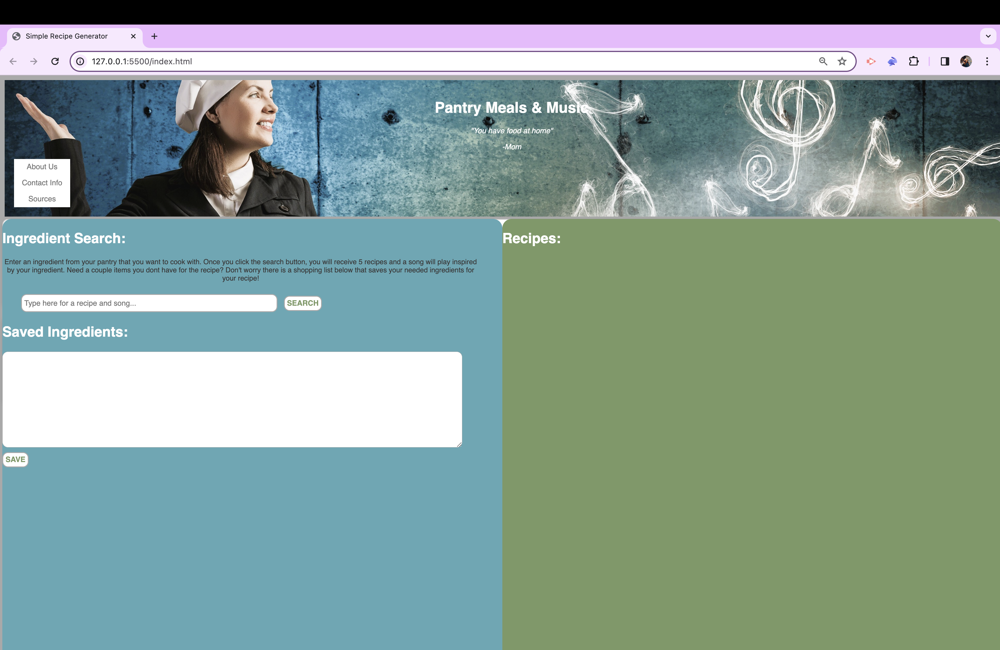

# Project 01 - Pantry Meals & Music

## Description:
This project uses HTML, JS, and CSS to build our website Pantry Meals & Music. This website uses two server side APIs to fetch 5 recipes based off of the ingredient that you search, and the other API will pull up a song based on that ingredient as well. We also have a Local Storage feature that allows you to save anything you don't have at home.
## Image and link

Link to website: https://zallen16.github.io/recipe-generator/
## Installation:
N/A
## Usage:
The use of this website is to get recipes based on ingredient that you already have, and to listen to music while you do it. You can also save any missing ingredients that you have on a shopping list that will save to local storage.
## Credits:
N/A
## License:
N/A